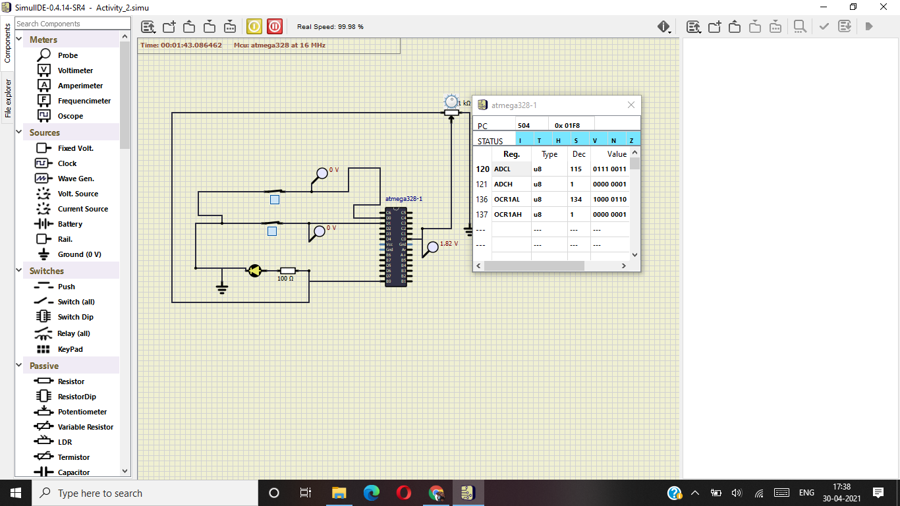
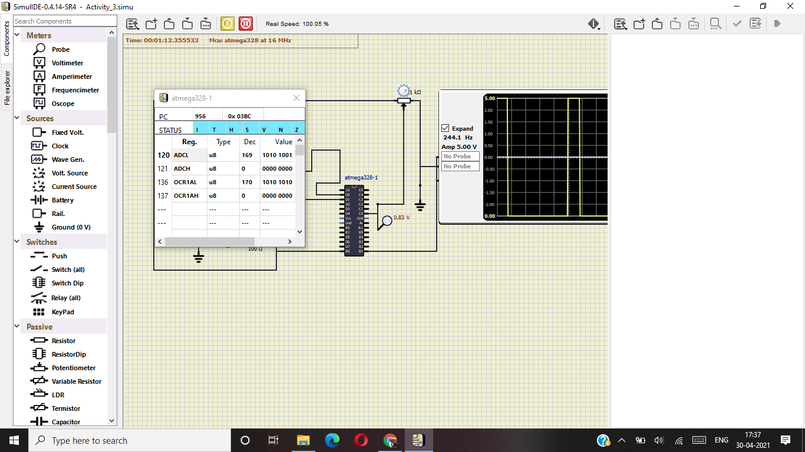

# Embedded-Project_302584

# Activity_1
 ## In Action

|ON|OFF|
|:--:|:--:|
|||

# Activity_2

 
 # Activity_3

# Activity_4

|ON|OFF|
|:--:|:--:|
|||

#### CI and Code Quality

|Build|Cppcheck|Codacy|Code Inspector|
|:--:|:--:|:--:|:--|
|||||

